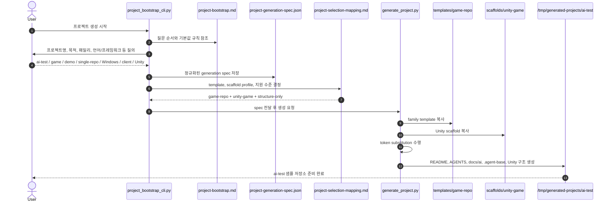

# Example Output: ai-test Bootstrap Sequence

## Summary

이 문서는 `harness-foundry`로 `ai-test`라는 샘플 프로젝트를 실제로 생성할 때 어떤 질문이 오가고, 어떤 선택이 spec으로 정규화되며, 최종적으로 어떤 scaffold가 생성되는지 예시로 보여준다.

## Scenario

- 프로젝트명: `ai-test`
- 프로젝트 패밀리: `game`
- 프로젝트 성격: `demo`
- 저장소 구성 방식: `single-repo`
- 프로젝트 목적: `태양계의 모든 행성들의 라그랑주 포인트를 찾아내는 게임`
- 대상 사용자: `게이머`
- 게임 형태 메모: `짧은 러너형 데모게임`
- 대상 플랫폼: `Windows`
- 런타임 역할: `client`
- 언어/프레임워크: `C# / Unity LTS`
- 데이터 저장소: `없음`
- cache: `없음`
- 배포 유형: `local-only`
- 서비스 기동 형태: `Unity player`
- 로깅 방식: `console`
- 동작 OS: `Windows`
- 보안/인증: `없음`

## Sequence Diagram



## Normalized Spec Snapshot

```json
{
  "repositoryName": "ai-test",
  "projectName": "ai-test",
  "projectPurpose": "태양계의 모든 행성들의 라그랑주 포인트를 찾아내는 게임",
  "projectFamily": "game",
  "projectNature": "demo",
  "repositoryMode": "single-repo",
  "targetUsers": ["게이머"],
  "targetPlatforms": ["Windows"],
  "runtimeRoles": ["client"],
  "language": "C#",
  "runtimeVersion": "Unity LTS",
  "framework": "Unity",
  "buildTool": "Unity",
  "testTool": "Unity validation",
  "datastore": "없음",
  "cache": "없음",
  "deploymentType": "local-only",
  "startupMode": "Unity player",
  "loggingMode": "console",
  "targetOs": ["Windows"],
  "securityProfile": "없음",
  "targetEnvironments": ["local", "dev"],
  "externalIntegrations": [],
  "baseDocumentSet": ["README", "build-guide", "test-plan"],
  "exceptions": []
}
```

## Mapping Result

- 기본 템플릿: `templates/game-repo`
- scaffold profile: `unity-game`
- 지원 수준: `structure-only`
- 후속 역할 오버레이: 없음
- DB 규칙 문서: 비적용
- 운영/배포 문서: `demo + local-only` 기준으로 최소 세트 유지

## Generated Output

생성 결과는 아래 구조를 최소 포함한다.

- root `README.md`
- root `AGENTS.md`
- `.agent-base/project-generation-spec.json`
- `.agent-base/generation-manifest.json`
- `.agent-base/refinement-manifest.json`
- `.agent-base/refinement-status.json`
- `.agent-base/pre-commit-config.json`
- `docs/ai/repo-local-overrides.md`
- `Packages/manifest.json`
- `ProjectSettings/ProjectVersion.txt`
- `Assets/Scripts/Bootstrap/GameBootstrap.cs`
- `docs/ai/*`
- `checklists/*`

## Immediate Follow-up

생성 직후에는 아래 작업을 이어서 수행한다.

1. `python3 scripts/install_git_hooks.py` 실행
2. `.agent-base/refinement-manifest.json`의 high-priority module을 먼저 확인
3. `python3 scripts/update_refinement_status.py --interactive --append-to-overrides`로 다음 pending module을 처리
4. `.agent-base/refinement-status.json`과 `docs/ai/repo-local-overrides.md`에 현재 결정과 defer note를 남김
5. `.agent-base/pre-commit-config.json`의 preset이 `unity-game`으로 잡혔는지 확인
6. `docs/ai/command-catalog.md`를 실제 Unity 명령 체계로 보정
7. `docs/ai/architecture-map.md`에 씬, 스크립트, 에셋 책임 경계 보정
8. 첫 scene bootstrap, 플레이 루프, validation 기준 정의
9. `checklists/project-creation.md`와 `checklists/first-delivery.md` 완료

## Why This Example Matters

- 인터뷰형 질문이 어떻게 실제 spec으로 굳어지는지 보여준다.
- `projectFamily`와 `runtimeRole`이 어떻게 다른 레벨의 선택인지 드러난다.
- `game + Unity`는 현재 `structure-only` scaffold라는 점을 분명히 보여준다.
- 생성 이후에도 repo-local 보정이 반드시 필요하다는 흐름을 설명한다.
